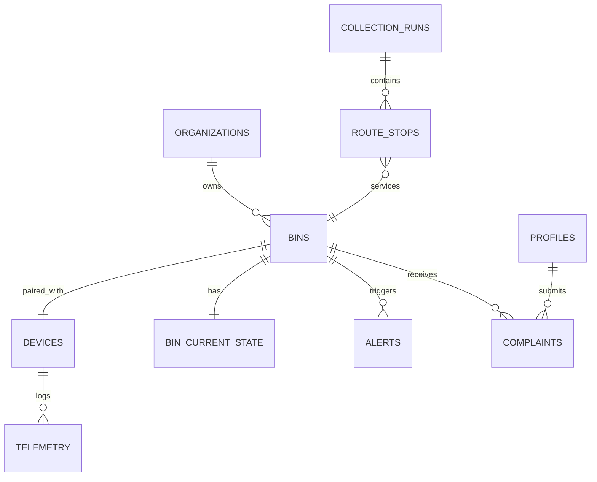

# Database Schema Specification — PostgreSQL & Supabase

## 1. Domain Entities & Relationships

## 2. Table Definitions

### `bins`
* `id` (UUID, Primary Key)
* `code` (VARCHAR, Unique, e.g. 'SB-024')
* `name` (VARCHAR, e.g. 'Legon Central Cafeteria Hub')
* `category` (VARCHAR, e.g. 'plastic', 'organic', 'paper', 'electronic', 'general')
* `capacity_liters` (INT, default 120 or 240)
* `latitude` (DOUBLE PRECISION)
* `longitude` (DOUBLE PRECISION)
* `address` (TEXT)
* `city` (VARCHAR)
* `zone` (VARCHAR)
* `created_at` (TIMESTAMPTZ)

### `bin_current_state` (High-Speed Dashboard Snapshot)
* `bin_id` (UUID, Primary Key, Foreign Key -> bins.id)
* `fill_percentage` (NUMERIC)
* `bin_status` (VARCHAR: 'NORMAL', 'FILLING', 'NEAR_FULL', 'FULL', 'OVERFLOW', 'OFFLINE')
* `lid_state` (VARCHAR: 'OPEN', 'CLOSED', 'FAULT')
* `distance_cm` (NUMERIC)
* `battery_percentage` (INT)
* `temperature_c` (NUMERIC)
* `wifi_rssi` (INT)
* `gps_latitude` (DOUBLE PRECISION)
* `gps_longitude` (DOUBLE PRECISION)
* `connection_status` (VARCHAR: 'ONLINE', 'STALE', 'OFFLINE')
* `last_seen_at` (TIMESTAMPTZ)
* `updated_at` (TIMESTAMPTZ)

### `telemetry` (Append-Only Historical Time-Series)
* `id` (BIGSERIAL, Primary Key)
* `device_id` (VARCHAR)
* `bin_id` (UUID, Foreign Key -> bins.id)
* `fill_percentage` (NUMERIC)
* `distance_cm` (NUMERIC)
* `lid_state` (VARCHAR)
* `battery_percentage` (INT)
* `temperature_c` (NUMERIC)
* `wifi_rssi` (INT)
* `recorded_at` (TIMESTAMPTZ)

### `alerts`
* `id` (UUID, Primary Key)
* `bin_id` (UUID, Foreign Key -> bins.id)
* `alert_type` (VARCHAR: 'FULL', 'OVERFLOW', 'LOW_BATTERY', 'DEVICE_OFFLINE', 'LID_FAULT', 'SENSOR_FAULT')
* `severity` (VARCHAR: 'P1', 'P2', 'P3')
* `status` (VARCHAR: 'OPEN', 'ACKNOWLEDGED', 'ASSIGNED', 'RESOLVED', 'CLOSED')
* `message` (TEXT)
* `triggered_at` (TIMESTAMPTZ)
* `resolved_at` (TIMESTAMPTZ)

### `complaints`
* `id` (UUID, Primary Key)
* `ticket_number` (VARCHAR, e.g. 'TKT-2026-0042')
* `bin_id` (UUID, Foreign Key -> bins.id)
* `problem_type` (VARCHAR: 'Full bin', 'Overflow', 'Lid problem', 'Sensor issue', 'Other')
* `description` (TEXT)
* `priority` (VARCHAR: 'Low', 'Medium', 'High', 'Critical')
* `status` (VARCHAR: 'RECEIVED', 'ASSIGNED', 'IN_PROGRESS', 'RESOLVED', 'CLOSED')
* `evidence_url` (TEXT)
* `reporter_name` (VARCHAR)
* `created_at` (TIMESTAMPTZ)
